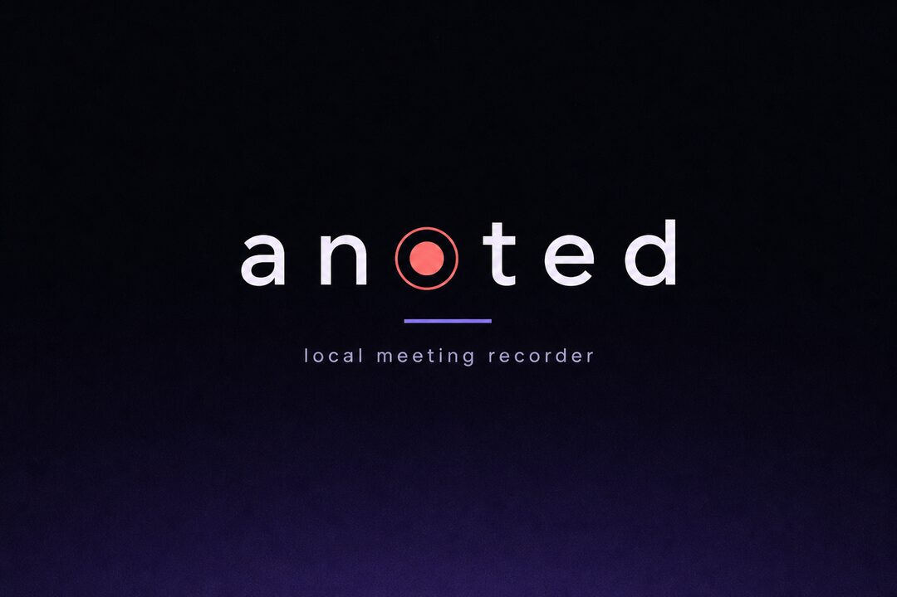
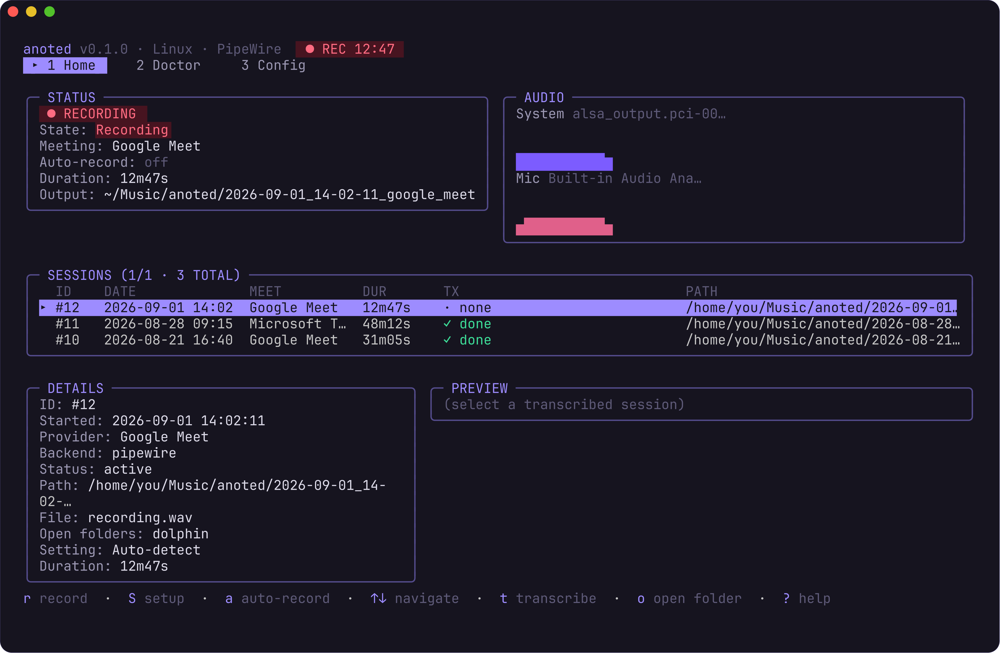
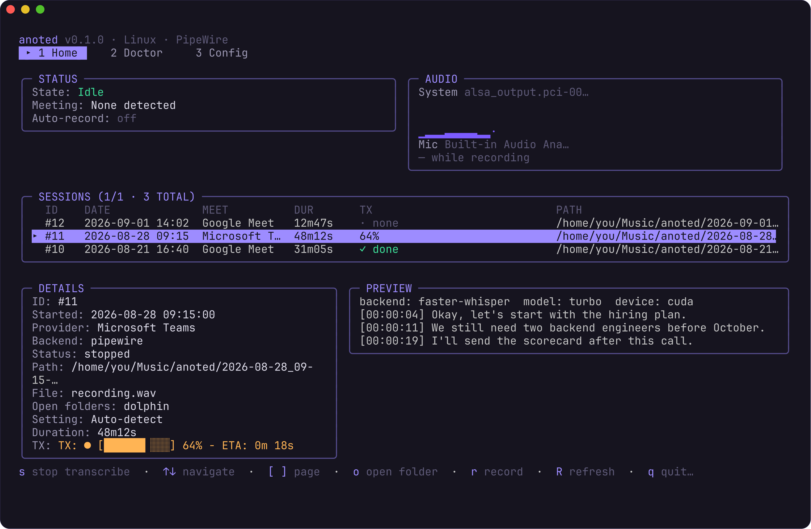
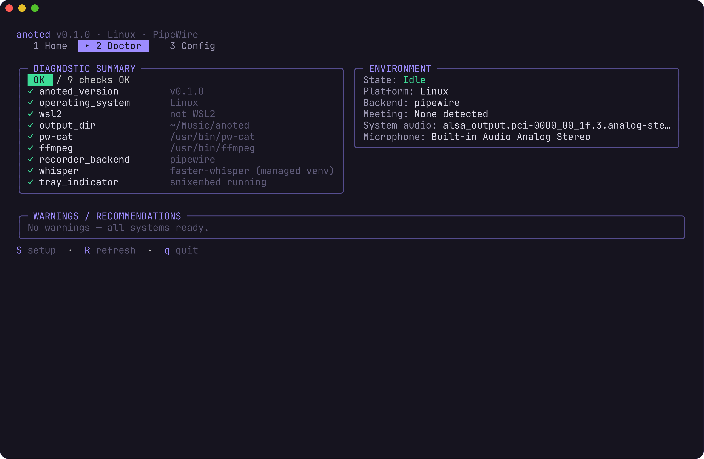
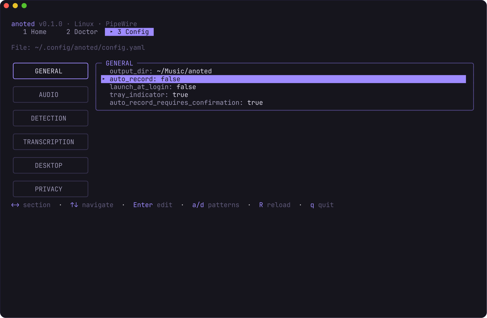

<p align="center">
  
</p>

<p align="center">
  <strong>Record meetings. Transcribe them on your machine. Keep the files.</strong><br>
  A terminal app for Linux and Windows — no cloud, no account, no hidden capture.
</p>

<p align="center">
  
  
  
  
</p>

---

anoted is a gift to anyone who wants meeting notes without uploading voices to a stranger's GPU. It watches for Google Meet or Microsoft Teams, records system audio plus your microphone, and can run [Whisper](https://github.com/openai/whisper) locally when you press `t`.

You always see when it is recording. Auto-record is off until you turn it on.

<p align="center">
  
</p>

## What it does today

- **Captures a meeting** from system loopback and the microphone, side by side, into a WAV you own
- **Detects Meet and Teams** from window titles (and from the microphone being in use)
- **Transcribes on-device** with Whisper (`turbo` by default) — txt, srt, vtt, json, or an Obsidian-friendly markdown note
- **Shows a live equalizer** so you can tell the capture is actually alive
- **Keeps a session library** in the same TUI: open the folder, play the file, delete, re-transcribe
- **Runs a Doctor tab** that checks tools, devices, GPU, and Whisper instead of dumping you into a wiki
- **Stays honest about privacy** — visible recording badge, optional tray icon, no uploads

<p align="center">
  
</p>

## Install

Pick your OS. Every merge to `main` publishes a **Nightly** pre-release with Linux and Windows binaries. Version tags (`v0.1.0`, …) create a named release.

### Linux

Download `anoted-linux-amd64.tar.gz` from [Releases](https://github.com/gmarinan/anoted/releases) (use **Nightly** unless you want a tagged version):

```bash
tar -xzf anoted-linux-amd64.tar.gz
sudo install -m 755 anoted /usr/local/bin/anoted
anoted setup && anoted doctor && anoted watch
```

PipeWire (or PulseAudio) should already be running. Useful extras: `pw-cat` / `ffmpeg`, `xdotool` or `wmctrl` for window-title detection, `snixembed` on GNOME or i3 for the tray.

To build from source you need [Go 1.24+](https://go.dev/dl/): `git clone` then `make build`.

Full walkthrough: [docs/linux.md](docs/linux.md)

### Windows 10 / 11

Download `anoted-windows-amd64.zip` from [Releases](https://github.com/gmarinan/anoted/releases), unzip, and run `anoted.exe` in [Windows Terminal](https://aka.ms/terminal):

```powershell
.\anoted.exe setup
.\anoted.exe doctor
.\anoted.exe watch
```

The exe is **unsigned** for now — SmartScreen may warn; that is the OS being cautious, not a virus. Allow microphone access in Windows Settings if it asks. Loopback follows the same OS privacy rules as any other recorder — anoted does not try to bypass them.

Config lives in `%AppData%\anoted\config.yaml`. Recordings default to `%USERPROFILE%\Music\anoted\`.

Building from source needs Go 1.24+ and a C compiler (cgo / WASAPI). GitHub Actions already does that for the zip above.

Full walkthrough, including WSL2: [docs/windows.md](docs/windows.md)

## First ten minutes

1. Run `anoted setup`, then `anoted watch`.
2. Press `r` to start a manual recording. The header turns into a pulsing **RECORDING** badge — that is the point.
3. Talk for a few seconds, press `r` again to stop.
4. Highlight the session, press `t` to transcribe (first run may download a Whisper model into a local venv — no sudo).
5. Press `o` to open the folder. You should see `recording.wav` and, after Whisper, `transcript.txt`.

```
~/Music/anoted/YYYY-MM-DD_HH-mm-ss_<provider>/
├── recording.wav
├── transcript.txt      # if Whisper ran
├── transcript.srt
├── transcript.md       # optional Obsidian note
└── metadata.json
```

<p align="center">
  
</p>

## Keyboard

Press `?` inside the app for this list. Sessions live on the Home tab.

| Key | Action |
|-----|--------|
| `1` `2` `3` | Home, Doctor, Config |
| `r` | Start / stop recording |
| `a` | Toggle auto-record |
| `y` / `n` | Confirm or dismiss the auto-record prompt |
| `t` | Transcribe the selected session (`s` stops it) |
| `o` / `p` | Open the folder / play the recording |
| `d` | Delete the selected session |
| `S` | Setup wizard |
| `i` / `g` | Install Whisper / GPU support (Doctor) |
| `q` | Quit (`Ctrl+C` from anywhere) |

Config saves as you edit. There is no extra save key.

## Privacy, on purpose

anoted is designed so a passer-by can tell it is recording. That protects the people in the call, not just the person running the app.

- Auto-record defaults to **off**. Turning it on can still require a `y` confirmation.
- The TUI, the terminal title, and (optionally) the tray all show recording state.
- Nothing is uploaded. There is no account, no telemetry, no transcription API.
- If the OS hides window titles (Wayland) or blocks loopback, anoted degrades — it does not jailbreak the compositor.

**You** are responsible for local law and for asking the other people on the call. The software's job is to make capture obvious.

## Configuration

| | Linux | Windows |
|---|--------|---------|
| Config | `~/.config/anoted/config.yaml` | `%AppData%\anoted\config.yaml` |
| Recordings | `~/Music/anoted/` | `~\Music\anoted\` |

Whisper is local. `faster-whisper` is the speed pick when you have a GPU; `auto` stays on the conservative backends so a first run does not surprise you with a multi-gigabyte download.

```yaml
transcription:
  auto_after_recording: false
  backend: auto                 # auto, openai-whisper, faster-whisper, whisper-cpp
  model: turbo
  device: auto                  # cpu, cuda, auto
  language: ""                  # empty = auto-detect
  output_formats: [txt, srt]
```

<p align="center">
  
</p>

## Roadmap

The next gift after transcripts is **meeting minutes**: feed a finished transcript to a local [Ollama](https://ollama.com) model and write decisions, owners, and next steps next to the recording. Same machine, no cloud — Ollama is the usual way to run those models locally.

Tracked as ideas, not promises:

- [ ] Minutes / summary via Ollama from a finished transcript
- [ ] First-class Windows installer (and signed `anoted.exe` on Releases)
- [ ] Smoother WSL2 helper protocol for people who live in the Linux TUI on Windows

Issues and PRs are welcome. This is a community project.

## Development

```bash
make test
make lint
make run

# No real audio, useful in CI or on a plane:
./bin/anoted watch --mock-detector --dummy-recorder
```

Architecture sketch:

```
cmd/anoted               CLI + TUI entrypoint
internal/tui             Bubble Tea UI (no OS-specific code)
internal/detector        Meeting detection (build tags)
internal/recorder        Audio backends (build tags)
internal/transcribe      Local Whisper wrappers
internal/session         SQLite + metadata
internal/config          YAML config
tools/windows-recorder   Optional WASAPI helper for WSL2
```

Regenerate the README screenshots (needs [`freeze`](https://github.com/charmbracelet/freeze)):

```bash
go install github.com/charmbracelet/freeze@latest
make readme-shots
```

## License

[MIT](LICENSE). Use it, fork it, ship it in your company laptop image. If it saves you from one more cloud recorder, that is the whole point.

Record kindly. Ask first.
